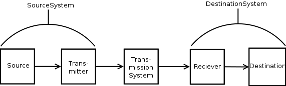
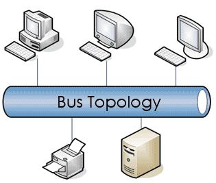
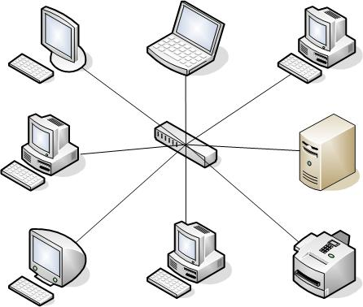
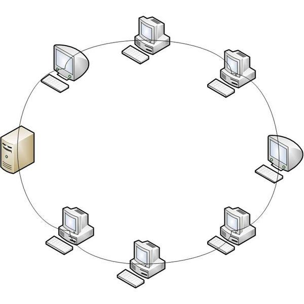
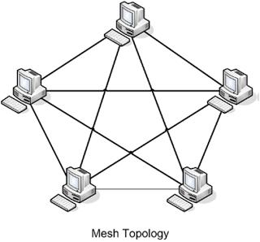
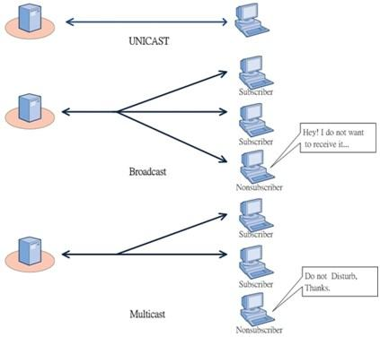

# High-Speed Networking Concepts

[TOC]

## Networks

A **Network** is a collection of computers or hardware devices that are connected either physically or logically to allow for exchange of information

### Communication Model

The **Communication Model** displays a very high-level analysis of any system with the parts defining as follows:

* **Source**: Generates data to be transmitted
* **Transmitter**: Converts data into transmittable signals
* **Transmission System**: Carrys Data
* **Reciever**: Converts recieved signal into data
* **Destination**: Takes incoming data

## Types of Networks

### Networks Based on Scale

#### LAN

A **Local Area Network (LAN)** is a computer network covering a small geographic area, like a home, office, or a small group of buildings.

Characteristics of LAN:

* Confined small areas (5 to 10km)
* High-Speed Data Transfer Rates (1000 Mbps)
* Low Error Rates
* Data and hardware sharing owned by network constructor
* Full time connectivity to local services
* Cabling and Wifi primary transmission mediums

#### WAN

A **Wide Area Network (WAN)** is a network covering large geographic areas, utilizing communications circuits to connect the intermediate nodes. Connects across distances of cities, states and countires.

Chracteristics of WAN:

* Large range of 100 km to 1000 km
* Much slower speeds from lan based on delay and packet loss (1.5 mbps to 2.4 Gbps)
* Highest possible Error Rates
* Data and hardware sharing owned by nodes across countries (country/state regulation)
* Segments of network interconnected by routers and gateways, hosts large number of computers and hosts

#### MAN

A **Metropolitan Area Network (MAN)** is a computer network larger then a local area network, covering an area of a few city blocks to the area of an entire city, possibly also including the surrounding areas.

Characteristics of MAN:

* Network Size between LAN and WAN (5 to 50 KM)
* Slower then LAN, Faster then WAN (1.5 to 150 Mbps)
* Moderate Error Rates
* Expensive

### Networks Based on Structure/Functional Relationship

### Networks based on Topology

#### Bus Topology

A **Bus Topology** uses a common backbone to connect all devices to a single cable. The backbone functions as a shared communication medium that devices attach or tap into with an interface connector.

**Advantages**

* Installation is easy and cheap
* Connections are simple
* Less cabling required

**Disadvantages**

* Used only in comparatively small networks
* Performance deteriorates when increasing the amount of computers beyond a certain limit
* Fault identification is difficult. A single fault in the cable stops all transmission

#### Star Topology

A **Star Topology** uses a centeral hub through which all components are connected. The centeral hob is the host computer and at the end of each connection is a terminal. Nodes communicate across the network by passing data through the hub

This is commonly seen for **Home Router Setups**

**Advantages**

* Installation and configuration is easy
* Less expensive (compared to mesh)
* Faults in network are easily traced
* Expansion and modification is easy. Single computer failure dosen't affect the network
* Supports multiple cable types

**Disadvantrages**

* Depends heavily on centeral device
* Performance depends on capacity of central device

#### Ring Topology

A **Ring Topology** has all devices connected to one another in a closed loop, so each device is connected to two other devices in a ring.

**Advantages**

* When network load increases, performance is better then that of the Bus topology
* No need for network server to control connectivity between workstations (**Token Ring Technology**)
* Aditional components do not affect performance
* Each computer has equal access to resources

**Disadvantages**

* If one node goes down they all do
* Only one machine can transmit at a time

#### Mesh Topology

A **Mesh Topology** has all devices connected to eachother (as they are in distance or wired) creating redundant paths between all devices. In a well connnected topology, every node would have a connection to every other node.

A fully connected mesh network therfore has $n(n-1)/2$ physical channels to link $n$ devices. To accommodate these, every device on the network must have $(n-1)$ input/output ports.

**Advantages**

* Use of dedicated links eliminates traffic problems.
* Failure of one node may not effect the whole network
* Point to point link makes isolation easy
* privacy between nodes is maintained
* It is robust

**Disadvantages**

* Cabling/Wireless receptability is high
* Large amount of I/O ports/slots required.

#### Hybrid Topology

A **Hybrid Topology** Combines two or more different topologies.

**Advantages**

* Any topology can be combined with another without making any changes to existing topology.
* The speed of the topology is compatabile because it combines the strengths of each of the topologies, eliminating weaknesses
* More Effiecent

**Disadvantages**

* Installation and configuration of topology is difficult.

## Internetwork

An **Internetwork** is the connection of two or more distinct computer networks or network segments via a common routing technology. Any interconnection amoung or between public, private, commeercial, industrial or governmental networks may also be defined as an internetwork.

### Intranet

An **Intranet** is a set of networks using the Internet Protocol and IP-based tools (web browsers, file transfer) under the control of a single administrative entity.

This is generally the internal network of an organization (very common in the **government**)

### Extranet

An **Extranet** is a network or internetwork that is limited in scope to a single organization or entity but ALSO has limited connection to other externalized networks (trusted organizations or entities).

### Internet

The **Internet** Is a compilation of networks across a global scale, connecting all networks accepting public communication. (Web services, websites, peer-to-peer clients).

**Examples**

* Sending an Email to a perosn in another conuntry
* Accessing news or products on a website
* Instant messaging with others anywhere

The Internt is created by the **Interconnection of Networks** belonging to **Internet Service Providers (ISPs)**. ISP networks connect eachother to provide access across the world.

All end systems are connected by a network of **Communication Links** (physical media/cables) and **Packet Switches** (circuit or digital packet routing)

The Internet can be described in **Two Perspectives**: Nuts-and-Bolts and Service Description

#### Nuts-and-Bolts Description

The **Nuts-and-Bolts** description defines the internet in terms of basic hardware and software components. These can be diagrammed for easy view of regional networks (however at a low level would be significantly too large to diagram easily)

#### Services Description

The **Services** description defines the internet as an infustructure that provides services to applications. For instance we might overview services such as:

**Existing/Currently Structuresd Services**

* Traditional data networks such as Linux workstations, store various amount of useful data
* Voice Networks (Phone Lines)
* Internet and Intranets (web pages, email)

**New/Advancing Services**

* Internet Telepony (voice over IP)
* Full-motion video (MPEG2, MPEG4)
* End systems (or hosts) such as Gaminc consoles, cell phones, Web cams, environmental sensing devices, home electical and security systems.

In instance, these **Distributed Applications** run on end nodes exchanging data to other end nodes. These end nodes are attached to the Internet provide an **Application Programming Interface (API)** that specifies how a software on one node asks the internet infastructure to deliver data to another end node.

An **Internet API** is a set of rules that software much follow so that it might reach required destinations.

There are **Two Types** of servicesto distributed applications:

* **Connection-oriented Service:** guarantees that data transmitted from a sender to a reciever will eventually be delivered to the reciever in order and completely
* **Connectionless Service:** Makes no guarantees about delivery

## Transmission Concepts

In general, there are **Three Types** of transmission technologies that are in widespread usage currently:

* **Unicast/Peer-to-Peer** : A message sent specifically to be recieved by one other computer.
* **Broadcast**: A message sent to be recieved by every node capable of listening
* **Multicast**: A message sent specifically to nodes who wish to recieve the data.

