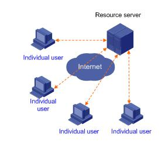
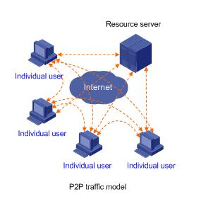
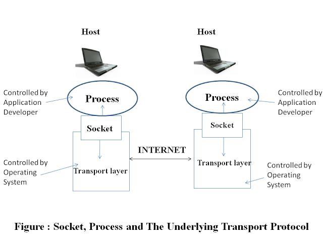

#Client-server and P2P architecture (Network Application Architectures)

[TOC]

The **Application Architecture** is designed by the application developer and dictates how the application is structured over various end systems.

There are **Two Architecture Types**:

##Client-Server Architecture

The **Client/Server Architecture** seperates tasks and/or workloads between providers and requesters. **Providers** are better known as **Servers/Hosts** and **Service Requesters** are best known as **Clients**

The Clients do not directly communicate with eachother, however they might interact via the Server

There are **Two different Tier's** client-server architectures might use:

###Two Tier Client-Server Architecture

The **Two-Tier Client-Server Architecture** consists simply of client machines connecting to a centeral server. It is the foundation of client/server computing.

### N-tier Client-Server Archiecture

In the **N-Tier Client-Server Archiecture** the **Server** the clients connect to might pull from one or more other Services internally that the clients don't have direct access to.

### Client-Server Archiectures Problems

Often, **Data Centers** combrised of multiple servers virtually connected to appear as a single host are used as many requests from clinets are handled. Based on ones location, multiple data centers might be employed based on location to handle massive waves of requests. These are often called **Infastructure intensive** due to the cost requirements and parts to maintain a **Server Farm**

## Peer-to-Peer Archiecture

A **Peer-to-Peer (P2P)** network is a type of decentralized network where multiple nodes called "peers" act as both suppliers and consumers of resources. (Torrents, Games, etc.). In this sense, each workstation shares capabilities and responsibilities between eachother.

These networks are also known as a **Distrubted Network*

The **Strength** of the P2P Archiecture is that it is self-scalable beacuse users are not directly centeralized basd on a server. however, a **Weakness** it holds is that security might be questionable when you might not be certain who the nodes are on the network.

## Hybrid Archiecture

The **Hybrid Architecture** is a combination of client-server and P2P computing. Utilizing both in a single format can eleviate certain weakness on each of the known archiectures.

One major **Example** would be **Instant Messaging** as:

* Chatting between two users is P2P
* Centeralized Server provides login to register IP address and stores messages

## Process Communication

A **Process** is a program running within an end system. Processes on two end systems communicate with eachother. Tbees processes send messages into and recieve messages from the network through a software interface called a **Socket**.

The following **shite image** should show this visually enough.

The **Socket** is an interface between the application layer and the transport layer within a host. It is refered to as an **API** between the application and the network, since it is the programming interface which network applications are built.

The application developer has only two choices down to the transport-layer:

* Choice of Transfer Protocol (TCP/UDP)
* Parameter specifics (within reason)

### Process Address

To send a packet to a host, the address of the destination host should be known. It comes in **Two Parts**:

* Address of the host (IP Address)
* Identifier that specifies the recieving process in the destination host (Port)