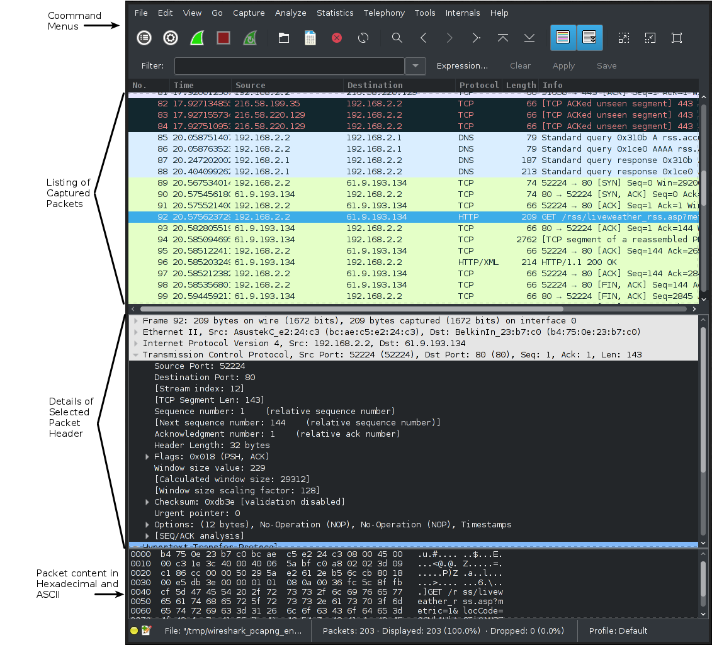

# High Speed Networks: Lab 0

## Introduction

**Wireshark** is a ** *Network Packet Analyzer* **. Its job is to attempt to capture packets passed across a network device (usb sticks are included) and display detailed information on the packets

In the past, these tools were expensive, however are made cheap with the free use of wireshark as it is also **Open Source**

Some **Basic Examples** of wireshark include:

- Network Administration in use to troubleshoot networking problems
- Network Security to examine security problems.
- Developers to debug protocol implementations
- Learning protocol internals and their low-level presentation

Wireshark can also be useful over a broad range of communication protocols as well, such as **Bluetooth, Zigbee,** and even **USB communication**

### Wireshark ph

The following **GUI Areas** function as such:

- **Command Menu**: allows you to access some of the key functions (if you don't know the short-key for it already or the menu quick-button)
- **Listing of Captured Packets**: Displays a short view of the packets which have been captured durring the time in which you activated the packet capturing software. it utilizes specifical colour codes to define what kind of packets they are.
- **Details of selected Packets**: Displays the header information of the packet which defines the data which has been carried. This is HIGHLY useful for seeing what sort of data you are dealing with
- **Hexedcimal/ASCII view**: Allows for a direct view of the packet information itself, which is useful for directly analyzing the information the packet is carrying.

## Test Running Wiresharks

Following the **insturctions**

